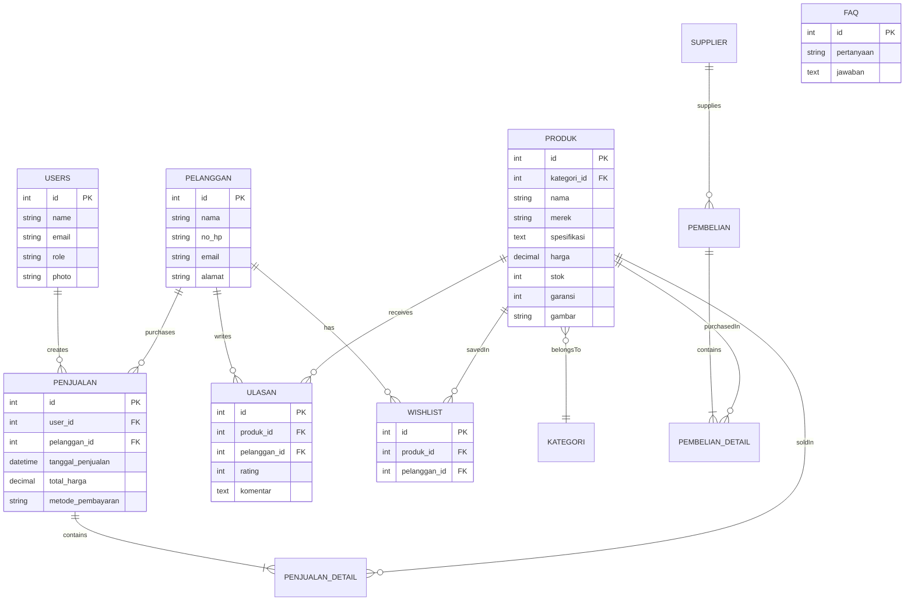

<div align="center">

# 🏪 Katalog Produk UMKM & Internal Management System

### Sistem Manajemen Terpadu untuk UMKM: Katalog, Transaksi, dan Operasional

[](https://laravel.com)
[](https://php.net)
[](https://mysql.com)
[](https://tailwindcss.com)

**Katalog Produk UMKM & Internal Management System** adalah solusi digital komprehensif yang dirancang untuk membantu UMKM mengelola bisnis mereka secara efisien. Mulai dari katalog produk online yang menarik, manajemen stok, transaksi kasir (POS) yang interaktif, hingga laporan keuangan dan integrasi AI.

[Instalasi](#-instalasi) • [Fitur](#-fitur-utama) • [API Documentation](#-rest-api) • [Tim Pengembang](#-tim-pengembang)

</div>

---

## 📑 Daftar Isi

- [Tech Stack](#-tech-stack)
- [Fitur Utama](#-fitur-utama)
- [Instalasi](#-instalasi)
- [Akun Default](#-akun-default)
- [REST API](#-rest-api)
- [Struktur Database](#-struktur-database)
- [Lisensi](#-lisensi)
- [Tim Pengembang](#-tim-pengembang)

---

## 🚀 Tech Stack

| Kategori | Teknologi |
|----------|-----------|
| **Backend Framework** | Laravel 12 |
| **Language** | PHP 8.2+ |
| **Frontend** | Blade Templates, TailwindCSS, Alpine.js, Bootstrap 5 |
| **Build Tool** | Vite |
| **Database** | MySQL |
| **Authentication** | Laravel Breeze, Laravel Sanctum |
| **Export** | DomPDF, Spatie Simple Excel |
| **AI Integration** | OpenAI / Custom Chatbot Service |
| **Package Manager** | Composer, NPM |

---

## ⚙️ Fitur Utama

### 🎨 Landing Page & Katalog Modern
- **Hero Carousel**: Tampilan banner promosi yang dinamis dan menarik perhatian.
- **Rotasi Logo Mitra**: Menampilkan logo brand atau mitra kerja sama dengan animasi halus.
- **Katalog Produk**: Tampilan grid produk yang responsif dengan filter kategori dan pencarian.
- **Detail Produk**: Informasi lengkap produk termasuk spesifikasi, stok, dan garansi.

### ⭐ Interaksi & Loyalitas Pelanggan
- **Sistem Ulasan & Rating**: Pelanggan dapat memberikan bintang dan komentar pada produk yang dibeli.
- **Wishlist / Bookmark**: Simpan produk favorit untuk dibeli nanti.
- **FAQ (Frequently Asked Questions)**: Halaman khusus untuk menjawab pertanyaan umum pelanggan.
- **AI Chatbot Assistant**: Asisten virtual cerdas untuk melayani pertanyaan pelanggan 24/7.

### 💰 Point of Sales (POS) Interaktif
- **Sidebar Product List**: Daftar produk yang selalu tampil di samping untuk akses cepat saat transaksi.
- **Keranjang Belanja Dinamis**: Tambah/kurang item dengan mudah tanpa reload halaman.
- **Multi-Payment**: Dukungan pembayaran Tunai, Transfer, dan QRIS.
- **Cetak Struk**: Print invoice transaksi langsung dari sistem.

### 📦 Manajemen Inventaris & Operasional
- **Manajemen Stok Real-time**: Stok berkurang otomatis saat penjualan dan bertambah saat pembelian.
- **Peringatan Stok**: Notifikasi visual untuk barang yang hampir habis.
- **Manajemen Supplier**: Database supplier dan riwayat pembelian (restock).

### 📊 Laporan & Analitik
- **Dashboard Admin**: Ringkasan performa bisnis harian/bulanan.
- **Laporan Penjualan**: Export data transaksi ke PDF dan Excel.
- **Analisa Terlaris**: Identifikasi produk paling diminati pelanggan.

### 🔐 Manajemen Pengguna
- **Role-Based Access**: Akses berbeda untuk Super Admin (Pemilik) dan Pegawai (Kasir).
- **Profil Pengguna**: Manajemen data diri dan keamanan akun.

### 🔌 REST API
- **Integrasi Mobile/External**: API lengkap untuk pengembangan aplikasi mobile atau integrasi pihak ketiga.
- **Dokumentasi Lengkap**: Tersedia Postman Collection untuk pengujian.

---

## 🧩 Instalasi

### Prasyarat
- PHP 8.2 atau lebih tinggi
- Composer
- Node.js & NPM
- MySQL
- Git

### Langkah Instalasi

#### 1️⃣ Clone Repository
```bash
git clone https://github.com/ThariqAdzikra/katalogLaptop.git
cd katalogLaptop
```

#### 2️⃣ Install Dependencies
```bash
# Install PHP dependencies
composer install

# Install JavaScript dependencies
npm install
```

#### 3️⃣ Konfigurasi Environment
```bash
# Salin file environment
cp .env.example .env
```

Edit file `.env` dan sesuaikan konfigurasi database:
```env
DB_CONNECTION=mysql
DB_HOST=127.0.0.1
DB_PORT=3306
DB_DATABASE=katalog_umkm
DB_USERNAME=root
DB_PASSWORD=
```

#### 4️⃣ Setup Storage & Gambar Produk

> **⚠️ PENTING:** Langkah ini wajib dilakukan agar seeder berjalan dengan baik!

```bash
# Buat symbolic link untuk storage
php artisan storage:link

# Buat folder produk (jika belum ada)
mkdir -p storage/app/public/produk
```

**Salin gambar produk:**
Pindahkan/salin semua file gambar dari `public/assets/produk` ke `storage/app/public/produk`

#### 5️⃣ Generate Key & Migrasi Database
```bash
# Generate application key
php artisan key:generate

# Jalankan migrasi dan seeder
php artisan migrate --seed
```

#### 6️⃣ Build Assets
```bash
# Development
npm run dev

# Production
npm run build
```

#### 7️⃣ Jalankan Aplikasi
```bash
php artisan serve
```

Aplikasi akan berjalan di `http://127.0.0.1:8000`

---

## 🔐 Akun Default

Setelah menjalankan seeder, gunakan kredensial berikut untuk login:

| Role | Email | Password |
|:-----|:------|:---------|
| 🔴 **Super Admin** | `admin@example.com` | `password` |
| 🔵 **Pegawai** | `pegawai@example.com` | `password` |

> **⚠️ KEAMANAN:** Segera ubah password default setelah instalasi pertama kali!

---

## 🔌 REST API

Sistem ini dilengkapi REST API dengan autentikasi Laravel Sanctum untuk integrasi dengan aplikasi eksternal.

### 🔑 Autentikasi API

API menggunakan **Bearer Token** yang didapatkan setelah login.

#### Endpoint Login
```http
POST /api/login
Content-Type: application/json

{
  "email": "admin@example.com",
  "password": "password"
}
```

**Response:**
```json
{
  "token": "1|abcdefghijklmnopqrstuvwxyz...",
  "user": { ... }
}
```

### 📋 Main Endpoints

| Method | Endpoint | Deskripsi |
|--------|----------|-----------|
| `POST` | `/api/login` | Login dan dapatkan token |
| `GET` | `/api/user` | Informasi user yang sedang login |
| `POST` | `/api/logout` | Logout dan hapus token |
| `GET` | `/api/penjualan` | Rekap penjualan (dengan filter) |
| `POST` | `/api/penjualan` | Buat transaksi penjualan baru |
| `GET` | `/api/penjualan/{id}` | Detail penjualan spesifik |
| `PUT` | `/api/penjualan/{id}` | Update transaksi penjualan |
| `DELETE` | `/api/penjualan/{id}` | Hapus transaksi penjualan |

### 🔍 Query Parameters untuk GET /api/penjualan

| Parameter | Tipe | Deskripsi | Contoh |
|-----------|------|-----------|--------|
| `dari_tanggal` | Date | Tanggal awal filter | `2025-01-01` |
| `sampai_tanggal` | Date | Tanggal akhir filter | `2025-12-31` |
| `metode` | String | Filter metode pembayaran | `cash`, `transfer`, `qris` |
| `search` | String | Pencarian nama pelanggan | `Budi` |
| `sort` | String | Sorting data | `tanggal`, `total`, `nama` |
| `page` | Integer | Halaman pagination | `1` |

### 📦 Contoh Request dengan cURL

**Get Rekap Penjualan:**
```bash
curl -X GET "http://127.0.0.1:8000/api/penjualan?dari_tanggal=2025-01-01&metode=cash" \
  -H "Accept: application/json" \
  -H "Authorization: Bearer YOUR_TOKEN_HERE"
```

**Buat Penjualan Baru:**
```bash
curl -X POST "http://127.0.0.1:8000/api/penjualan" \
  -H "Accept: application/json" \
  -H "Authorization: Bearer YOUR_TOKEN_HERE" \
  -H "Content-Type: application/json" \
  -d '{
    "tanggal_penjualan": "2025-11-28T14:30:00",
    "metode_pembayaran": "cash",
    "id_pelanggan": "1",
    "produk": [
      {"id_produk": 1, "jumlah": 1},
      {"id_produk": 2, "jumlah": 2}
    ]
  }'
```

---

## 🗄️ Struktur Database

### Entitas Utama



### Tabel-Tabel Database

| Tabel | Deskripsi | Relasi |
|-------|-----------|--------|
| `users` | Data pengguna sistem (admin & pegawai) | - |
| `kategoris` | Kategori produk | `produk.kategori_id` |
| `produk` | Master data produk UMKM | Many to kategori |
| `pelanggan` | Data pelanggan | - |
| `ulasan` | Feedback & Rating pelanggan | Many to produk, pelanggan |
| `wishlist` | Produk favorit pelanggan | Many to produk, pelanggan |
| `faq` | Daftar pertanyaan umum | - |
| `supplier` | Data supplier | - |
| `penjualan` | Header transaksi penjualan | Many to users, pelanggan |
| `penjualan_detail` | Detail item penjualan | Many to penjualan, produk |
| `pembelian` | Header transaksi pembelian | Many to supplier |
| `pembelian_detail` | Detail item pembelian | Many to pembelian, produk |
| `personal_access_tokens` | Token API Sanctum | Many to users |

---

## 🤝 Kontribusi

Proyek ini dikembangkan untuk tujuan edukasi. Kontribusi dan saran sangat diterima!

1. Fork repository ini
2. Buat branch fitur baru (`git checkout -b feature/AmazingFeature`)
3. Commit perubahan (`git commit -m 'Add some AmazingFeature'`)
4. Push ke branch (`git push origin feature/AmazingFeature`)
5. Buat Pull Request

---

## 📜 Lisensi

Proyek ini dibuat **untuk tujuan edukasi** dalam rangka Mata Kuliah Pengembangan Sistem Informasi Berbasis Web Lanjut di Universitas Riau.

**Tidak diperjualbelikan** dan ditujukan untuk kebutuhan akademik.

---

## 👨‍💻 Tim Pengembang

<div align="center">

### **Kelompok 3**

*Mata Kuliah: Pengembangan Sistem Informasi Berbasis Web Lanjut*

**Fakultas Matematika dan Ilmu Pengetahuan Alam**  
**Universitas Riau**

#### Anggota Tim

| Nama | NIM |
|------|-----|
| **M. Thariq Adzikra** | 2303113029 |
| **Ryanda Valents Anarki** | 2303113649 |
| **Dimas Adji Isnanda** | 2303111837 |
| **Frenky Estiawan** | 2303114719 |
| **M. Dzaki Faiq A** | 2303114718 |
| **M. Farhan** | 2303110123 |

---

### 🌐 Live Demo

**Website:** [https://kataloglaptop.dpdns.org/](https://kataloglaptop.dpdns.org/)

[](https://jagoanhosting.com)

---

Dikembangkan dengan ❤️ menggunakan Laravel

[](https://github.com/ThariqAdzikra)

</div>

---

<div align="center">

### 📧 Butuh Bantuan?

Jika mengalami kendala dalam instalasi atau penggunaan, silakan buat [Issue](https://github.com/ThariqAdzikra/katalogLaptop/issues) di repository ini.

**⭐ Jangan lupa berikan star jika proyek ini bermanfaat!**

</div>
