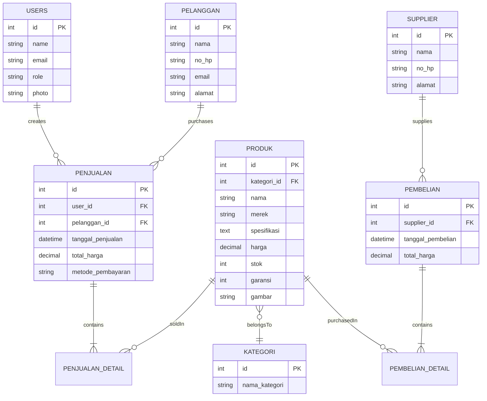

<div align="center">

# 💻 Katalog Laptop

### Sistem Manajemen Katalog dan Transaksi Laptop Berbasis Web

[](https://laravel.com)
[](https://php.net)
[](https://mysql.com)
[](https://tailwindcss.com)

**Katalog Laptop** adalah sistem manajemen terpadu untuk mengelola katalog produk, transaksi pembelian dari supplier, pengelolaan stok, penjualan, dan laporan transaksi. Dilengkapi dengan REST API berbasis Laravel Sanctum untuk integrasi eksternal.

[Instalasi](#-instalasi) • [Fitur](#-fitur-utama) • [API Documentation](#-rest-api) • [Tim Pengembang](#-tim-pengembang)

</div>

---

## 📑 Daftar Isi

- [Tech Stack](#-tech-stack)
- [Fitur Utama](#-fitur-utama)
- [Instalasi](#-instalasi)
- [Akun Default](#-akun-default)
- [REST API](#-rest-api)
- [Struktur Database](#-struktur-database)
- [Lisensi](#-lisensi)
- [Tim Pengembang](#-tim-pengembang)

---

## 🚀 Tech Stack

| Kategori | Teknologi |
|----------|-----------|
| **Backend Framework** | Laravel 12 |
| **Language** | PHP 8.2+ |
| **Frontend** | Blade Templates, TailwindCSS, Alpine.js, Bootstrap 5 |
| **Build Tool** | Vite |
| **Database** | MySQL |
| **Authentication** | Laravel Breeze, Laravel Sanctum |
| **Export** | DomPDF, Spatie Simple Excel |
| **Package Manager** | Composer, NPM |

---

## ⚙️ Fitur Utama

### 🔐 Manajemen Pengguna
- **Role-Based Access Control**: Super Admin & Pegawai
- **Autentikasi**: Laravel Breeze dengan fitur login, register, dan password reset
- **Profil Pengguna**: Upload foto profil dan edit informasi

### 📱 Katalog Publik
- Menampilkan daftar produk laptop untuk calon pembeli
- Pencarian dan filter berdasarkan merek/kategori/spesifikasi
- Tampilan responsif dan user-friendly

### 📦 Manajemen Stok
- CRUD lengkap untuk produk laptop
- Upload dan manajemen gambar produk
- Indikator visual untuk stok menipis dan habis
- Kategorisasi produk
- Pencatatan masa garansi produk

### 🛒 Pembelian dari Supplier
- Mencatat transaksi pembelian produk dari supplier
- Perhitungan total harga otomatis
- Penambahan stok otomatis setelah pembelian
- Riwayat pembelian lengkap dengan detail item

### 💰 Sistem Kasir (Penjualan)
- **Interface Kasir 2 Kolom** yang intuitif
- Penambahan produk ke keranjang secara dinamis
- **Perhitungan real-time** untuk total transaksi
- **Multiple Payment Methods**:
  - 💵 Cash (Tunai)
  - 🏦 Transfer Bank
  - 📱 QRIS dengan preview
- Pengurangan stok otomatis
- Cetak struk/invoice

### 📊 Laporan Penjualan
- Filter berdasarkan rentang tanggal
- Filter berdasarkan metode pembayaran
- Ringkasan total penjualan harian/bulanan
- **Export ke PDF** menggunakan DomPDF
- **Export ke Excel** dengan Spatie Simple Excel

### 🔌 REST API
- **Token-based Authentication** menggunakan Laravel Sanctum
- Endpoint untuk manajemen penjualan (CRUD)
- Filtering, sorting, dan pagination
- Format respons JSON yang terstruktur
- Dokumentasi lengkap dengan Postman Collection

---

## 🧩 Instalasi

### Prasyarat
- PHP 8.2 atau lebih tinggi
- Composer
- Node.js & NPM
- MySQL
- Git

### Langkah Instalasi

#### 1️⃣ Clone Repository
```bash
git clone https://github.com/ThariqAdzikra/katalogLaptop.git
cd katalogLaptop
```

#### 2️⃣ Install Dependencies
```bash
# Install PHP dependencies
composer install

# Install JavaScript dependencies
npm install
```

#### 3️⃣ Konfigurasi Environment
```bash
# Salin file environment
cp .env.example .env
```

Edit file `.env` dan sesuaikan konfigurasi database:
```env
DB_CONNECTION=mysql
DB_HOST=127.0.0.1
DB_PORT=3306
DB_DATABASE=katalog_laptop
DB_USERNAME=root
DB_PASSWORD=
```

#### 4️⃣ Setup Storage & Gambar Produk

> **⚠️ PENTING:** Langkah ini wajib dilakukan agar seeder berjalan dengan baik!

```bash
# Buat symbolic link untuk storage
php artisan storage:link

# Buat folder produk (jika belum ada)
mkdir -p storage/app/public/produk
```

**Salin gambar produk:**
Pindahkan/salin semua file gambar dari `public/assets/laptop` ke `storage/app/public/produk`

#### 5️⃣ Generate Key & Migrasi Database
```bash
# Generate application key
php artisan key:generate

# Jalankan migrasi dan seeder
php artisan migrate --seed
```

#### 6️⃣ Build Assets
```bash
# Development
npm run dev

# Production
npm run build
```

#### 7️⃣ Jalankan Aplikasi
```bash
php artisan serve
```

Aplikasi akan berjalan di `http://127.0.0.1:8000`

---

## 🔐 Akun Default

Setelah menjalankan seeder, gunakan kredensial berikut untuk login:

| Role | Email | Password |
|:-----|:------|:---------|
| 🔴 **Super Admin** | `admin@example.com` | `password` |
| 🔵 **Pegawai** | `pegawai@example.com` | `password` |

> **⚠️ KEAMANAN:** Segera ubah password default setelah instalasi pertama kali!

---

## 🔌 REST API

Sistem ini dilengkapi REST API dengan autentikasi Laravel Sanctum untuk integrasi dengan aplikasi eksternal.

### 🔑 Autentikasi API

API menggunakan **Bearer Token** yang didapatkan setelah login.

#### Endpoint Login
```http
POST /api/login
Content-Type: application/json

{
  "email": "admin@example.com",
  "password": "password"
}
```

**Response:**
```json
{
  "token": "1|abcdefghijklmnopqrstuvwxyz...",
  "user": { ... }
}
```

### 📋 Main Endpoints

| Method | Endpoint | Deskripsi |
|--------|----------|-----------|
| `POST` | `/api/login` | Login dan dapatkan token |
| `GET` | `/api/user` | Informasi user yang sedang login |
| `POST` | `/api/logout` | Logout dan hapus token |
| `GET` | `/api/penjualan` | Rekap penjualan (dengan filter) |
| `POST` | `/api/penjualan` | Buat transaksi penjualan baru |
| `GET` | `/api/penjualan/{id}` | Detail penjualan spesifik |
| `PUT` | `/api/penjualan/{id}` | Update transaksi penjualan |
| `DELETE` | `/api/penjualan/{id}` | Hapus transaksi penjualan |

### 🔍 Query Parameters untuk GET /api/penjualan

| Parameter | Tipe | Deskripsi | Contoh |
|-----------|------|-----------|--------|
| `dari_tanggal` | Date | Tanggal awal filter | `2025-01-01` |
| `sampai_tanggal` | Date | Tanggal akhir filter | `2025-12-31` |
| `metode` | String | Filter metode pembayaran | `cash`, `transfer`, `qris` |
| `search` | String | Pencarian nama pelanggan | `Budi` |
| `sort` | String | Sorting data | `tanggal`, `total`, `nama` |
| `page` | Integer | Halaman pagination | `1` |

### 📦 Contoh Request dengan cURL

**Get Rekap Penjualan:**
```bash
curl -X GET "http://127.0.0.1:8000/api/penjualan?dari_tanggal=2025-01-01&metode=cash" \
  -H "Accept: application/json" \
  -H "Authorization: Bearer YOUR_TOKEN_HERE"
```

**Buat Penjualan Baru:**
```bash
curl -X POST "http://127.0.0.1:8000/api/penjualan" \
  -H "Accept: application/json" \
  -H "Authorization: Bearer YOUR_TOKEN_HERE" \
  -H "Content-Type: application/json" \
  -d '{
    "tanggal_penjualan": "2025-11-28T14:30:00",
    "metode_pembayaran": "cash",
    "id_pelanggan": "1",
    "produk": [
      {"id_produk": 1, "jumlah": 1},
      {"id_produk": 2, "jumlah": 2}
    ]
  }'
```

### 📘 Tutorial Lengkap Testing REST API dengan Postman

Berikut adalah panduan lengkap untuk mengonfigurasi dan menguji REST API menggunakan **Laravel Sanctum** dan **Postman**.

#### Langkah 1: Instalasi Laravel Sanctum

> **ℹ️ Info:** Jika Anda sudah menjalankan `composer install`, Sanctum sudah terinstall. Namun berikut adalah langkah-langkah untuk memastikan semuanya berfungsi dengan baik.

1. **Install package Sanctum** (jika belum):
   ```bash
   composer require laravel/sanctum
   ```

2. **Publish file migrasi & konfigurasi Sanctum**:
   ```bash
   php artisan vendor:publish --provider="Laravel\Sanctum\SanctumServiceProvider"
   ```

3. **Jalankan Migrasi** (untuk membuat tabel `personal_access_tokens`):
   ```bash
   php artisan migrate
   ```

4. **Pastikan Model User menggunakan trait `HasApiTokens`**:
   
   Buka `app/Models/User.php` dan verifikasi kode berikut ada:
   ```php
   <?php
   namespace App\Models;

   use Illuminate\Foundation\Auth\User as Authenticatable;
   use Laravel\Sanctum\HasApiTokens; // <-- PASTIKAN INI ADA

   class User extends Authenticatable
   {
       use HasApiTokens; // <-- PASTIKAN INI ADA
       // ... sisa kode model Anda
   }
   ```

#### Langkah 2: Impor Koleksi Postman

Daripada membuat request satu per satu, gunakan collection yang sudah disiapkan.

1. Buka **Postman**

2. Klik tombol **Import** di pojok kiri atas

3. Pilih tab **Raw Text**

4. **Salin dan paste** seluruh kode JSON di bawah ini:

<details>
<summary><b>📋 Klik untuk melihat JSON Postman Collection</b></summary>

```json
{
    "info": {
        "_postman_id": "0c5a1a1f-1b1e-4f5c-8d3e-9e7f8a6b4c10",
        "name": "API Penjualan Laptop Store",
        "schema": "https://schema.getpostman.com/json/collection/v2.1.0/collection.json"
    },
    "item": [
        {
            "name": "Autentikasi",
            "item": [
                {
                    "name": "[POST] Login (Get Token)",
                    "request": {
                        "method": "POST",
                        "header": [
                            {
                                "key": "Accept",
                                "value": "application/json"
                            }
                        ],
                        "body": {
                            "mode": "raw",
                            "raw": "{\n    \"email\": \"admin@example.com\",\n    \"password\": \"password\"\n}",
                            "options": {
                                "raw": {
                                    "language": "json"
                                }
                            }
                        },
                        "url": {
                            "raw": "{{base_url}}/api/login",
                            "host": [
                                "{{base_url}}"
                            ],
                            "path": [
                                "api",
                                "login"
                            ]
                        },
                        "description": "Gunakan request ini untuk mendapatkan Bearer Token. Salin token dari respons."
                    },
                    "response": []
                },
                {
                    "name": "[GET] Cek User Login",
                    "request": {
                        "auth": {
                            "type": "bearer",
                            "bearer": [
                                {
                                    "key": "token",
                                    "value": "{{auth_token}}",
                                    "type": "string"
                                }
                            ]
                        },
                        "method": "GET",
                        "header": [
                            {
                                "key": "Accept",
                                "value": "application/json"
                            }
                        ],
                        "url": {
                            "raw": "{{base_url}}/api/user",
                            "host": [
                                "{{base_url}}"
                            ],
                            "path": [
                                "api",
                                "user"
                            ]
                        },
                        "description": "Gunakan ini untuk tes apakah token Anda valid."
                    },
                    "response": []
                },
                {
                    "name": "[POST] Logout",
                    "request": {
                        "auth": {
                            "type": "bearer",
                            "bearer": [
                                {
                                    "key": "token",
                                    "value": "{{auth_token}}",
                                    "type": "string"
                                }
                            ]
                        },
                        "method": "POST",
                        "header": [
                            {
                                "key": "Accept",
                                "value": "application/json"
                            }
                        ],
                        "url": {
                            "raw": "{{base_url}}/api/logout",
                            "host": [
                                "{{base_url}}"
                            ],
                            "path": [
                                "api",
                                "logout"
                            ]
                        },
                        "description": "Menghapus token yang sedang digunakan."
                    },
                    "response": []
                }
            ]
        },
        {
            "name": "Penjualan (Sales)",
            "item": [
                {
                    "name": "[GET] Rekap Penjualan (Index/Laporan)",
                    "protocolProfileBehavior": {
                        "disableBodyPruning": true
                    },
                    "request": {
                        "auth": {
                            "type": "bearer",
                            "bearer": [
                                {
                                    "key": "token",
                                    "value": "{{auth_token}}",
                                    "type": "string"
                                }
                            ]
                        },
                        "method": "GET",
                        "header": [
                            {
                                "key": "Accept",
                                "value": "application/json"
                            }
                        ],
                        "body": {
                            "mode": "raw",
                            "raw": "",
                            "options": {
                                "raw": {
                                    "language": "json"
                                }
                            }
                        },
                        "url": {
                            "raw": "{{base_url}}/api/penjualan?dari_tanggal=2025-01-01&sampai_tanggal=2025-12-31&metode=cash&page=1&sort=total",
                            "host": [
                                "{{base_url}}"
                            ],
                            "path": [
                                "api",
                                "penjualan"
                            ],
                            "query": [
                                {
                                    "key": "dari_tanggal",
                                    "value": "2025-01-01",
                                    "description": "Format: YYYY-MM-DD"
                                },
                                {
                                    "key": "sampai_tanggal",
                                    "value": "2025-12-31",
                                    "description": "Format: YYYY-MM-DD"
                                },
                                {
                                    "key": "metode",
                                    "value": "cash",
                                    "description": "cash, transfer, atau qris"
                                },
                                {
                                    "key": "page",
                                    "value": "1"
                                },
                                {
                                    "key": "sort",
                                    "value": "total",
                                    "description": "tanggal, total, atau nama"
                                },
                                {
                                    "key": "search",
                                    "value": "Budi",
                                    "disabled": true
                                }
                            ]
                        },
                        "description": "Endpoint utama untuk rekap data. Semua query param opsional."
                    },
                    "response": []
                },
                {
                    "name": "[POST] Buat Penjualan (Store)",
                    "request": {
                        "auth": {
                            "type": "bearer",
                            "bearer": [
                                {
                                    "key": "token",
                                    "value": "{{auth_token}}",
                                    "type": "string"
                                }
                            ]
                        },
                        "method": "POST",
                        "header": [
                            {
                                "key": "Accept",
                                "value": "application/json"
                            }
                        ],
                        "body": {
                            "mode": "raw",
                            "raw": "{\n    \"tanggal_penjualan\": \"2025-11-16T14:30:00\",\n    \"metode_pembayaran\": \"qris\",\n\n    \"id_pelanggan\": \"1\", \n\n    \"produk\": [\n        {\n            \"id_produk\": 1,\n            \"jumlah\": 1\n        },\n        {\n            \"id_produk\": 2,\n            \"jumlah\": 2\n        }\n    ]\n}",
                            "options": {
                                "raw": {
                                    "language": "json"
                                }
                            }
                        },
                        "url": {
                            "raw": "{{base_url}}/api/penjualan",
                            "host": [
                                "{{base_url}}"
                            ],
                            "path": [
                                "api",
                                "penjualan"
                            ]
                        },
                        "description": "Membuat transaksi baru.\n\n**Untuk Pelanggan Baru:**\nUbah `id_pelanggan` menjadi `null` atau `\"NEW_Nama Pelanggan\"` dan tambahkan data pelanggan baru:\n\n```json\n{\n    \"tanggal_penjualan\": \"2025-11-16T14:30:00\",\n    \"metode_pembayaran\": \"qris\",\n\n    \"id_pelanggan\": \"NEW_Pelanggan Baru API\",\n    \"nama_pelanggan_baru\": \"Pelanggan Baru API\",\n    \"no_hp_baru\": \"08123456789\",\n    \"email_baru\": \"baru@api.com\",\n    \"alamat_baru\": \"Jl. API\",\n\n    \"produk\": [\n        {\n            \"id_produk\": 1,\n            \"jumlah\": 1\n        }\n    ]\n}\n```"
                    },
                    "response": []
                },
                {
                    "name": "[GET] Detail Penjualan (Show)",
                    "request": {
                        "auth": {
                            "type": "bearer",
                            "bearer": [
                                {
                                    "key": "token",
                                    "value": "{{auth_token}}",
                                    "type": "string"
                                }
                            ]
                        },
                        "method": "GET",
                        "header": [
                            {
                                "key": "Accept",
                                "value": "application/json"
                            }
                        ],
                        "url": {
                            "raw": "{{base_url}}/api/penjualan/1",
                            "host": [
                                "{{base_url}}"
                            ],
                            "path": [
                                "api",
                                "penjualan",
                                "1"
                            ],
                            "variable": [
                                {
                                    "key": "id",
                                    "value": "1"
                                }
                            ]
                        },
                        "description": "Mengambil satu data penjualan spesifik beserta detail produknya."
                    },
                    "response": []
                },
                {
                    "name": "[PUT] Update Penjualan (Update)",
                    "request": {
                        "auth": {
                            "type": "bearer",
                            "bearer": [
                                {
                                    "key": "token",
                                    "value": "{{auth_token}}",
                                    "type": "string"
                                }
                            ]
                        },
                        "method": "PUT",
                        "header": [
                            {
                                "key": "Accept",
                                "value": "application/json"
                            }
                        ],
                        "body": {
                            "mode": "raw",
                            "raw": "{\n    \"tanggal_penjualan\": \"2025-11-17T10:00:00\",\n    \"metode_pembayaran\": \"cash\",\n\n    \"id_pelanggan\": \"1\", \n\n    \"produk\": [\n        {\n            \"id_produk\": 3,\n            \"jumlah\": 1\n        }\n    ]\n}",
                            "options": {
                                "raw": {
                                    "language": "json"
                                }
                            }
                        },
                        "url": {
                            "raw": "{{base_url}}/api/penjualan/1",
                            "host": [
                                "{{base_url}}"
                            ],
                            "path": [
                                "api",
                                "penjualan",
                                "1"
                            ],
                            "variable": [
                                {
                                    "key": "id",
                                    "value": "1"
                                }
                            ]
                        },
                        "description": "Mengupdate data penjualan. (Mengembalikan stok lama, mengurangi stok baru)"
                    },
                    "response": []
                },
                {
                    "name": "[DELETE] Hapus Penjualan (Destroy)",
                    "request": {
                        "auth": {
                            "type": "bearer",
                            "bearer": [
                                {
                                    "key": "token",
                                    "value": "{{auth_token}}",
                                    "type": "string"
                                }
                            ]
                        },
                        "method": "DELETE",
                        "header": [
                            {
                                "key": "Accept",
                                "value": "application/json"
                            }
                        ],
                        "url": {
                            "raw": "{{base_url}}/api/penjualan/1",
                            "host": [
                                "{{base_url}}"
                            ],
                            "path": [
                                "api",
                                "penjualan",
                                "1"
                            ],
                            "variable": [
                                {
                                    "key": "id",
                                    "value": "1"
                                }
                            ]
                        },
                        "description": "Menghapus data penjualan (Stok akan dikembalikan)"
                    },
                    "response": []
                }
            ]
        }
    ],
    "auth": {
        "type": "bearer",
        "bearer": [
            {
                "key": "token",
                "value": "{{auth_token}}",
                "type": "string"
            }
        ]
    },
    "event": [
        {
            "listen": "prerequest",
            "script": {
                "type": "text/javascript",
                "exec": [
                    ""
                ]
            }
        },
        {
            "listen": "test",
            "script": {
                "type": "text/javascript",
                "exec": [
                    ""
                ]
            }
        }
    ],
    "variable": [
        {
            "key": "base_url",
            "value": "http://127.0.0.1:8000"
        },
        {
            "key": "auth_token",
            "value": "SALIN_TOKEN_DARI_LOGIN_KESINI"
        }
    ]
}
```

</details>

5. Paste kode JSON ke dalam kotak teks Postman

6. Klik **Continue**, lalu **Import**

7. Collection baru bernama **API Penjualan Laptop Store** akan muncul di sidebar

#### Langkah 3: Atur Variabel `base_url`

Konfigurasi URL server lokal Anda:

1. Di sidebar kiri, klik nama collection **API Penjualan Laptop Store**
2. Klik tab **Variables**
3. Di baris `base_url`, kolom **CURRENT VALUE**, masukkan:
   ```
   http://127.0.0.1:8000
   ```
   atau jika menggunakan live demo:
   ```
   https://kataloglaptop.dpdns.org
   ```
4. Klik **Save** (ikon disket di kanan atas)

#### Langkah 4: Dapatkan Token (Login)

Login untuk mendapatkan token autentikasi:

1. Di sidebar kiri, buka folder **Autentikasi**
2. Klik request **[POST] Login (Get Token)**
3. Klik tab **Body** - pastikan email dan password benar:
   - Email: `admin@example.com`
   - Password: `password`
4. Klik **Send**

#### Langkah 5: Simpan Token

Jika login berhasil, Anda akan melihat respons JSON dengan token:

1. Di bagian **Response** (bawah), salin nilai **token** (contoh: `1|abcde...`)
2. Kembali ke tab **Variables** collection
3. Di baris `auth_token`, kolom **CURRENT VALUE**, paste token Anda
4. Klik **Save**

> **💡 Tips:** Token akan menggantikan teks `SALIN_TOKEN_DARI_LOGIN_KESINI`

#### Langkah 6: Test Endpoints

Sekarang Anda siap menguji API:

1. Di sidebar kiri, buka folder **Penjualan (Sales)**
2. Klik request **[GET] Rekap Penjualan (Index/Laporan)**
3. Klik **Send**

**Hasil yang diharapkan:** Anda akan melihat data penjualan dalam format JSON.

> **⚠️ Troubleshooting:** Jika mendapat error **401 Unauthorized**, ulangi Langkah 4 & 5 karena token mungkin sudah kedaluwarsa atau belum tersimpan dengan benar.

#### Langkah 7: Eksplorasi Endpoints Lainnya

Collection ini menyediakan berbagai endpoint:

**Autentikasi:**
- POST Login (Get Token)
- GET Cek User Login
- POST Logout

**Penjualan:**
- GET Rekap Penjualan (dengan filter & pagination)
- POST Buat Penjualan Baru
- GET Detail Penjualan
- PUT Update Penjualan
- DELETE Hapus Penjualan

Semua request sudah dikonfigurasi dengan **Bearer Token** otomatis menggunakan variabel `{{auth_token}}`!

---

## 🗄️ Struktur Database

### Entitas Utama



### Tabel-Tabel Database

| Tabel | Deskripsi | Relasi |
|-------|-----------|--------|
| `users` | Data pengguna sistem (admin & pegawai) | - |
| `kategoris` | Kategori produk laptop | `produk.kategori_id` |
| `produk` | Master data produk laptop | Many to kategori |
| `pelanggan` | Data pelanggan | - |
| `supplier` | Data supplier | - |
| `penjualan` | Header transaksi penjualan | Many to users, pelanggan |
| `penjualan_detail` | Detail item penjualan | Many to penjualan, produk |
| `pembelian` | Header transaksi pembelian | Many to supplier |
| `pembelian_detail` | Detail item pembelian | Many to pembelian, produk |
| `personal_access_tokens` | Token API Sanctum | Many to users |

---

## 🤝 Kontribusi

Proyek ini dikembangkan untuk tujuan edukasi. Kontribusi dan saran sangat diterima!

1. Fork repository ini
2. Buat branch fitur baru (`git checkout -b feature/AmazingFeature`)
3. Commit perubahan (`git commit -m 'Add some AmazingFeature'`)
4. Push ke branch (`git push origin feature/AmazingFeature`)
5. Buat Pull Request

---

## 📜 Lisensi

Proyek ini dibuat **untuk tujuan edukasi** dalam rangka Mata Kuliah Pengembangan Sistem Informasi Berbasis Web Lanjut di Universitas Riau.

**Tidak diperjualbelikan** dan ditujukan untuk kebutuhan akademik.

---

## 👨‍💻 Tim Pengembang

<div align="center">

### **Kelompok 3**

*Mata Kuliah: Pengembangan Sistem Informasi Berbasis Web Lanjut*

**Fakultas Matematika dan Ilmu Pengetahuan Alam**  
**Universitas Riau**

#### Anggota Tim

| Nama | NIM |
|------|-----|
| **M. Thariq Adzikra** | 2303113029 |
| **Ryanda Valents Anarki** | 2303113649 |
| **Dimas Adji Isnanda** | 2303111837 |
| **Frenky Estiawan** | 2303114719 |
| **M. Dzaki Faiq A** | 2303114718 |
| **M. Farhan** | 2303110123 |

---

### 🌐 Live Demo

**Website:** [https://kataloglaptop.dpdns.org/](https://kataloglaptop.dpdns.org/)

[](https://jagoanhosting.com)

---

Dikembangkan dengan ❤️ menggunakan Laravel

[](https://github.com/ThariqAdzikra)

</div>

---

<div align="center">

### 📧 Butuh Bantuan?

Jika mengalami kendala dalam instalasi atau penggunaan, silakan buat [Issue](https://github.com/ThariqAdzikra/katalogLaptop/issues) di repository ini.

**⭐ Jangan lupa berikan star jika proyek ini bermanfaat!**

</div>
